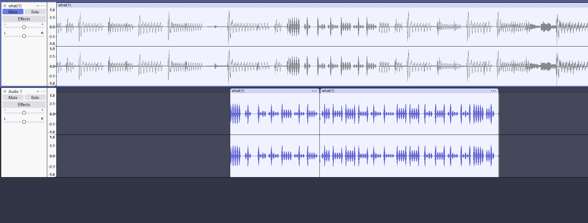
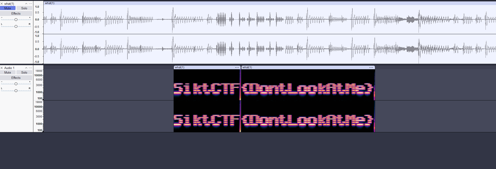

<h2>Challenge description:</h2>

```
Ness is fighting the Sanctuary Guardian, you must help him!
A what.wav file is provided
```

<h2>Solve:</h2>
Listening to this absolute banger i hear some parts of the track that sound abnormal.

<audio controls src="what.wav" title="what.wav"></audio>

I find these parts and snip them out of the original track into another track using Audacity



<audio controls src="what_only_weird_parts.wav" title="Second track"></audio>

At first i thought the audio might be some encoded digital transmission, so i started reading.

I stumbled upon [this](https://ctf-wiki.mahaloz.re/misc/audio/introduction/) webpage. It shows flags being represented in frequencies, so i decide to give it a go by changing to spectrogram on the second track.

There we see text and the flag:



<h2>Flag:</h2>

```
SiktCTF{DontLookAtMe}
```