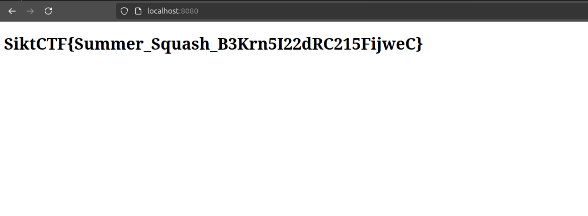

<h2>Challenge description:</h2>

```
I dont know about you, but i find zucchinis to be terribly plain. And who decided to name them that, anyways?

```

<h2>Solve:</h2>

I started by running binwalk on the provided file called "zucchini":
```
vscode ➜ /workspaces/SiktCTF-2024/Misc/zucchini (main) $ binwalk zucchini 

DECIMAL       HEXADECIMAL     DESCRIPTION
--------------------------------------------------------------------------------
0             0x0             Squashfs filesystem, little endian, version 4.0, compression:gzip, size: 94031949 bytes, 41688 inodes, blocksize: 131072 bytes, created: 2024-08-05 05:04:45
```

I read about Squashfs and originally tried to boot it as a VM. This did not succeed.

After i tried to extract the squashfs file:

```

vscode ➜ /workspaces/SiktCTF-2024/Misc/zucchini (main) $ sudo unsquashfs zucchini 
Parallel unsquashfs: Using 8 processors
43147 inodes (12876 blocks) to write

[========================================================================================================================================================- ] 12872/12876  99%

created 29992 files
created 5401 directories
created 6287 symlinks
created 8 devices
created 0 fifos
created 0 sockets
```
The first time i attempted to extract i did not run as root, but it still resulted in some files. This confused me a bit until i tried again with sudo.

This revealed the entire filsystem:
```
vscode ➜ /workspaces/SiktCTF-2024/Misc/zucchini (main) $ ll squashfs-root/
total 72
drwxr-xr-x 18 root   root   4096 Aug  5 05:04 ./
drwxrwxr-x  4 vscode vscode 4096 Oct 19 17:30 ../
lrwxrwxrwx  1 root   root      7 Apr 22 13:08 bin -> usr/bin/
drwxr-xr-x  2 root   root   4096 Apr 22 13:08 boot/
drwxr-xr-x  5 root   root   4096 Aug  5 05:02 dev/
-rwxr-xr-x  1 root   root      0 Aug  5 05:02 .dockerenv*
drwxr-xr-x 39 root   root   4096 Aug  5 05:02 etc/
drwxr-xr-x  3 root   root   4096 Jun  5 02:06 home/
lrwxrwxrwx  1 root   root      7 Apr 22 13:08 lib -> usr/lib/
lrwxrwxrwx  1 root   root      9 Apr 22 13:08 lib64 -> usr/lib64/
drwxr-xr-x  2 root   root   4096 Oct  1  2023 lib.usr-is-merged/
drwxr-xr-x  2 root   root   4096 Jun  5 02:02 media/
drwxr-xr-x  2 root   root   4096 Jun  5 02:02 mnt/
drwxr-xr-x  2 root   root   4096 Jun  5 02:02 opt/
dr-xr-xr-x 12 root   root   4096 Aug  5 05:02 proc/
drwx------  2 root   root   4096 Aug  5 05:01 root/
drwxr-xr-x  4 root   root   4096 Aug  5 05:00 run/
lrwxrwxrwx  1 root   root      8 Apr 22 13:08 sbin -> usr/sbin/
drwxr-xr-x  2 root   root   4096 Jun  5 02:02 srv/
dr-xr-xr-x 11 root   root   4096 Aug  5 04:28 sys/
drwxrwxrwt  2 root   root   4096 Aug  5 05:01 tmp/
drwxr-xr-x 12 root   root   4096 Jun  5 02:02 usr/
drwxr-xr-x 12 root   root   4096 Aug  5 05:00 var/
```

I tried to look for flag related files, but i only found som bait in /tmp/flag.txt which was not the correct flag:
```
#This command gave a lot of output. It also must have contained the actual flag, but it was impossible to search for due to all of the matches:
vscode ➜ .../SiktCTF-2024/Misc/zucchini/squashfs-root (main) $ sudo grep -ari "flag" ./


#Looking for the flag.txt file
vscode ➜ .../SiktCTF-2024/Misc/zucchini/squashfs-root (main) $ sudo find . -iname "*flag*"
./usr/lib/x86_64-linux-gnu/perl/5.38.2/bits/waitflags.ph
./usr/lib/x86_64-linux-gnu/perl/5.38.2/bits/ss_flags.ph
./proc/fs/cifs/SecurityFlags
./proc/kpageflags
./proc/sys/net/ipv6/fib_notify_on_flag_change
./proc/sys/net/ipv4/fib_notify_on_flag_change
./tmp/flag.txt
./sys/module/usbip_core/parameters/usbip_debug_flag
./sys/module/scsi_mod/parameters/default_dev_flags
./sys/devices/virtual/net/eth0/flags
./sys/devices/virtual/net/lo/flags
./sys/devices/platform/serial8250/tty/ttyS0/flags
./sys/devices/platform/serial8250/tty/ttyS1/flags
./sys/devices/platform/serial8250/tty/ttyS2/flags
./sys/devices/platform/serial8250/tty/ttyS3/flags
vscode ➜ .../SiktCTF-2024/Misc/zucchini/squashfs-root (main) $ cat ./tmp/flag.txt 
so you got into the filesystem, eh?
vscode ➜ .../SiktCTF-2024/Misc/zucchini/squashfs-root (main) $ 
```

After no success in the cli i poked around in the filestructure. After looking for a while i came across the var/www directory. There i found a index.html file which looked out of place.

```html

<!DOCTYPE html>
<html>
<head>
    <title>Secret</title>
</head>
<body>
    <h1 id="flag"></h1>
    <script>
        function decodeBase64(str) {
            return atob(str);
        }

        function decryptFlag(encrypted, key) {
            var decipher = crypto.subtle.importKey("raw", new Uint8Array(decodeBase64(key).split('').map(c => c.charCodeAt(0))), "AES-CBC", false, ["decrypt"]).then(key => {
                var iv = new Uint8Array(decodeBase64(encrypted).split('').slice(0, 16).map(c => c.charCodeAt(0)));
                var data = new Uint8Array(decodeBase64(encrypted).split('').slice(16).map(c => c.charCodeAt(0)));
                return crypto.subtle.decrypt({ name: "AES-CBC", iv: iv }, key, data);
            }).then(decrypted => {
                var decoder = new TextDecoder();
                return decoder.decode(new Uint8Array(decrypted));
            }).catch(err => console.error(err));
            return decipher;
        }

        var encryptedFlag = "UM1FH1zLiTyU2loo3FCu/tgvY9ATq37m2cbkvNEWbyKIwBB1nfjlRetpaZ/2Av+LAyOzSsq9QF6BFYKE/gi5jg==";
        var key = "H2t5Yvr4lNEjCPrTsGz5mA==";

        decryptFlag(encryptedFlag, key).then(flag => {
            document.getElementById("flag").innerHTML = flag;
        });
    </script>
</body>
</html>

```

Running this with a webserver and checking out the page reveals the flag:
```
vscode ➜ .../zucchini/squashfs-root/var/www (main) $ python3 -m http.server 8080
Serving HTTP on 0.0.0.0 port 8080 (http://0.0.0.0:8080/) ...
```



This challenge was very interesting due to the flag bein scrambled in the HTML file. That made it hard to grep for "SiktCTF" or variants of a flag. Since the html has "encryptedFlag" and "decryptFlag" i probably matched them in my previous grep attempts, but due to the big amount of output i did not see the file.


<h2>Flag:</h2>

```
SiktCTF{Summer_Squash_B3Krn5I22dRC215FijweC}
```