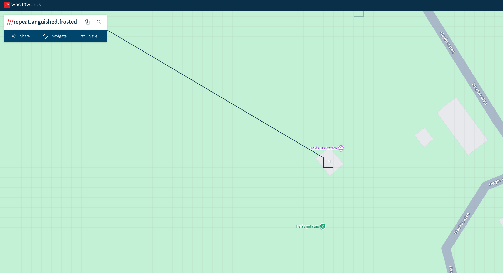

Running exiftool returns a field called "Sub-location" which i thought looked interesting.
```
exiftool hytte.jpg:
ExifTool Version Number         : 12.40
File Name                       : hytte.jpg
Directory                       : .
File Size                       : 17 KiB
File Modification Date/Time     : 2024:10:10 22:14:55+02:00
File Access Date/Time           : 2024:10:10 22:55:00+02:00
File Inode Change Date/Time     : 2024:10:10 22:14:55+02:00
File Permissions                : -rwxrwxrwx
File Type                       : JPEG
File Type Extension             : jpg
MIME Type                       : image/jpeg
JFIF Version                    : 1.01
Resolution Unit                 : inches
X Resolution                    : 96
Y Resolution                    : 96
Current IPTC Digest             : 8ead02cedfbfe741276062aa4dcc9848
Sub-location                    : repeat.anguished.frosted <----------------------
Application Record Version      : 4
Image Width                     : 468
Image Height                    : 309
Encoding Process                : Baseline DCT, Huffman coding
Bits Per Sample                 : 8
Color Components                : 3
Y Cb Cr Sub Sampling            : YCbCr4:2:0 (2 2)
Image Size                      : 468x309
Megapixels                      : 0.145
```

After googling a bit it turns out there is a service called what3words. This service identifies a 3mx3m all around the world with just three words. Putting repeat.anguished.frosted into their website shows us the cabin.


Flag:
```
SiktCTF{Høiås}
```