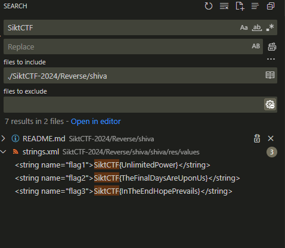
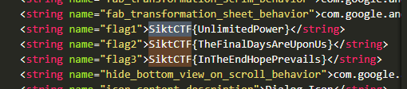

<h2>Challenge description:</h2>

```
There are three seperate flags on in this android app. find the first flag. First flag is plain Second flag is waiting for your signature Third flag is not positive
```

<h2>Solve:</h2>

The shiva.apk file was provided in the challenge. APK is associated with android apps, so found apktool which can decode .apk files.

```
h@flakse:~/git/SiktCTF-2024/Reverse/shiva$ apktool d shiva.apk 
I: Using Apktool 2.5.0-dirty on shiva.apk
I: Loading resource table...
I: Decoding AndroidManifest.xml with resources...
I: Loading resource table from file: /home/h/.local/share/apktool/framework/1.apk
I: Regular manifest package...
I: Decoding file-resources...
I: Decoding values */* XMLs...
I: Baksmaling classes.dex...
I: Baksmaling classes2.dex...
I: Copying assets and libs...
I: Copying unknown files...
I: Copying original files...
I: Copying META-INF/services directory
h@flakse:~/git/SiktCTF-2024/Reverse/shiva$ 
``` 

Doing a quick search in the resulting folder "./shiva/" for SiktCTF i instantly found the three flags. I wonder if this was intentional. The challenge description makes it seem that this should be harder.





<h2>Flag:</h2>

```
SiktCTF{UnlimitedPower}
SiktCTF{TheFinalDaysAreUponUs}
SiktCTF{InTheEndHopePrevails}
```