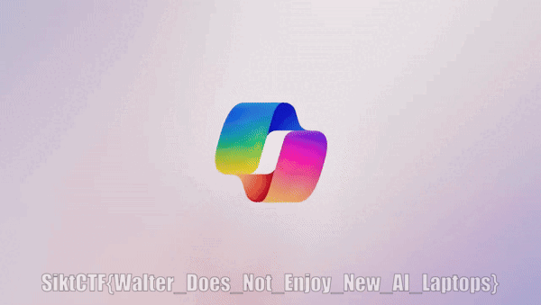

<h2>Challenge description:</h2>

```
Oh, news from microsoft. What could this be about?
```

<h2>Solve:</h2>

Looking through the GIF i see a brief flash of some letters. Right before the AI logo hits the key.


I converted the .gif to individual png frames using "convert":
```
convert Copilot.gif gifToFrames/output%05d.png
```

Looking through the frames i see that frame number 86 has the flag:


<h2>Flag:</h2>

```
SiktCTF{Walter_Does_Not_Enjoy_New_AI_Laptops}
```


