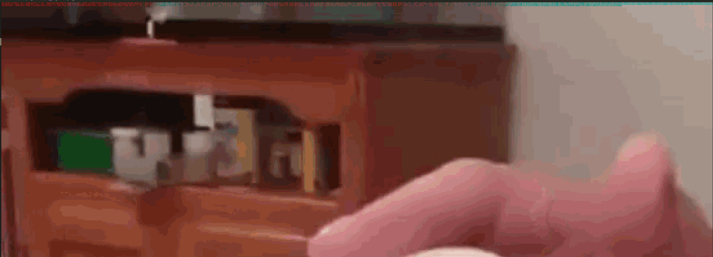

<h2>Challenge description:</h2>

```
A duck handed me this image and said: Nak? Naknak. Naknak nak! Nananak Nak Naknak Naknak. Naknak nak. Nananak Nak Naknaknak Nak? Naknak Nak. Naknak nak? Nananak Nak Naknaknak Nananak Naknak nak? Naknak Nak? I dont get it, can you figure out what that means?
```

<h2>Solve:</h2>

Looking closely at the image i see a pattern at the top of it.


Decoding the Challenge description in a Nak Nak (Duckspeak) decoder reveals the following hint:
https://www.cachesleuth.com/nak.html

"Im in the red"

This confirms my suspicion of the top being data encoded in the image.

I tried using zsteg to no avail, but found "stegsolve" thanks to [this](https://www.youtube.com/watch?v=JBIbL8zwZOs) video.

I use stegsolve Data Extractor to extract data based on the red channels. Then i base64 decode the data. The result is more nak nak (Duckspeak) so i use the same website and get this out:
```
Hello, is this what you are looking for? SiktCTF{IM_mULTil1NGU4l_MY_M0TH3R_TOuNG3_I5_DUC5p34k}
```

[Solution Video](solve.webm)


<h2>Flag:</h2>

```
SiktCTF{IM_mULTil1NGU4l_MY_M0TH3R_TOuNG3_I5_DUC5p34k}
```