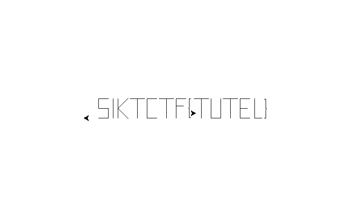

<h2>Challenge description:</h2>

```
Look at these cute turtles (tortoises?) i found on the interwebs. 🐢🐢🐢
```

<h2>Solve:</h2>
I started by running the "strings" command on the files to see if there was any strings hidden in the files:

At the end of files there are some code that looks like directions for a pen. I remember there exists a python library for drawing and that its called "Turtle". Both files contain directions.

```
strings turtle.jpeg 
penup()
left(180)
goto(-200, -10)
left(180)
pendown()
forward(20)
left(90)
forward(20)
left(90)
forward(20)
right(90)
forward(20)
right(90)
forward(20)
penup()
forward(10)
right(90)
pendown()
forward(40)
penup()
left(90)
forward(10)
pendown()
left(90)
forward(40)
backward(20)
right(45)
forward(30)
backward(30)
right(90)
forward(30)
backward(30)
right(45)
forward(20)
penup()
left(90)
forward(40)
left(90)
pendown()
forward(40)
left(90)
forward(15)
backward(30)
penup()
backward(25)
pendown()
forward(20)
left(90)
forward(40)
left(90)
forward(20)
penup()
forward(20)
left(90)
pendown()
forward(40)
left(90)
forward(15)
backward(30)
penup()
backward(25)
pendown()
forward(20)
left(90)
forward(40)
backward(25)
left(90)
forward(15)
penup()
left(90)
forward(15)
right(90)
forward(15)
pendown()
backward(3)
right(90)
forward(18)
right(45)
forward(2)
left(90)
forward(2)
right(45)
forward(18)
left(90)
forward(3)
penup()
goto(142, -10)
setheading(0)
pendown()
forward(3)
left(90)
forward(18)
right(45)
forward(2)
left(90)
forward(2)
right(45)
forward(18)
left(90)
forward(3)
penup()
goto(180, -10)
```

```
strings tortoise.jpeg 
penup()
goto(12,-10)
setheading(90)
pendown()
forward(40)
left(90)
forward(15)
backward(30)
penup()
backward(5)
left(90)
pendown()
forward(40)
left(90)
forward(20)
left(90)
forward(40)
penup()
right(90)
forward(5)
pendown()
forward(30)
backward(15)
right(90)
forward(40)
penup()
left(90)
forward(40)
pendown()
backward(20)
left(90)
forward(20)
right(90)
forward(15)
backward(15)
left(90)
forward(20)
right(90)
forward(20)
penup()
forward(10)
right(90)
pendown()
forward(40)
left(90)
forward(15)
penup()
goto(-230,-10)
setheading(180)
```

I combined both outputs into a python file:
```python
from time import sleep
import turtle

s = turtle.getscreen()
t = turtle.Turtle()


t.penup()
t.left(180)
t.goto(-200, -10)
t.left(180)
t.pendown()
t.forward(20)
t.left(90)
t.forward(20)
t.left(90)
t.forward(20)
t.right(90)
t.forward(20)
t.right(90)
t.forward(20)
t.penup()
t.forward(10)
t.right(90)
t.pendown()
t.forward(40)
t.penup()
t.left(90)
t.forward(10)
t.pendown()
t.left(90)
t.forward(40)
t.backward(20)
t.right(45)
t.forward(30)
t.backward(30)
t.right(90)
t.forward(30)
t.backward(30)
t.right(45)
t.forward(20)
t.penup()
t.left(90)
t.forward(40)
t.left(90)
t.pendown()
t.forward(40)
t.left(90)
t.forward(15)
t.backward(30)
t.penup()
t.backward(25)
t.pendown()
t.forward(20)
t.left(90)
t.forward(40)
t.left(90)
t.forward(20)
t.penup()
t.forward(20)
t.left(90)
t.pendown()
t.forward(40)
t.left(90)
t.forward(15)
t.backward(30)
t.penup()
t.backward(25)
t.pendown()
t.forward(20)
t.left(90)
t.forward(40)
t.backward(25)
t.left(90)
t.forward(15)
t.penup()
t.left(90)
t.forward(15)
t.right(90)
t.forward(15)
t.pendown()
t.backward(3)
t.right(90)
t.forward(18)
t.right(45)
t.forward(2)
t.left(90)
t.forward(2)
t.right(45)
t.forward(18)
t.left(90)
t.forward(3)
t.penup()
t.goto(142, -10)
t.setheading(0)
t.pendown()
t.forward(3)
t.left(90)
t.forward(18)
t.right(45)
t.forward(2)
t.left(90)
t.forward(2)
t.right(45)
t.forward(18)
t.left(90)
t.forward(3)
t.penup()
t.goto(180, -10)

t.penup()
t.goto(12,-10)
t.setheading(90)
t.pendown()
t.forward(40)
t.left(90)
t.forward(15)
t.backward(30)
t.penup()
t.backward(5)
t.left(90)
t.pendown()
t.forward(40)
t.left(90)
t.forward(20)
t.left(90)
t.forward(40)
t.penup()
t.right(90)
t.forward(5)
t.pendown()
t.forward(30)
t.backward(15)
t.right(90)
t.forward(40)
t.penup()
t.left(90)
t.forward(40)
t.pendown()
t.backward(20)
t.left(90)
t.forward(20)
t.right(90)
t.forward(15)
t.backward(15)
t.left(90)
t.forward(20)
t.right(90)
t.forward(20)
t.penup()
t.forward(10)
t.right(90)
t.pendown()
t.forward(40)
t.left(90)
t.forward(15)
t.penup()
t.goto(-230,-10)
t.setheading(180)


sleep(5000)
```

A really funny issue i ran into was naming the file "turtle.py". This confused the import.


Running the python code resulted in the flag:



<h2>Flag:</h2>

```
SiktCTF{TUTEL}
```