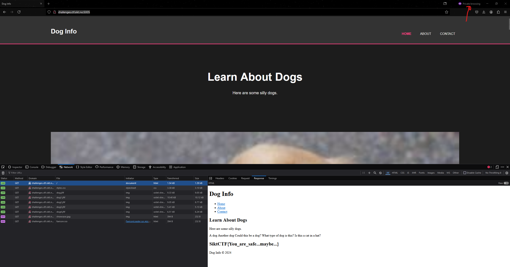

<h2>Challenge description:</h2>

```
This simple dog info site is a privacy nightmare. Just look at those ads.
http://challenges.ctf.sikt.no:5005/ 
```

<h2>Solve</h2>
The site looks like this and has two ads:
<video controls src="20241012-1603-36.6443389.mp4" title="WEbsite"></video>

As you can see i start poking around the website. I don't really find anything.


I tried opening it in Firefox privacy mode to disable my ad-blocker because i thought it might be related to that.
To my suprise the next response contains the flag.


Digging through the request headers sent i see that the privacy mode sends two headers called "Sec-GPC: 1" and "DNT: 1". These are not sent in the regular browsing window.

We can confirm that the DNT header is required for the flag by using Curl:
```
h@flakse:~$ curl -s http://challenges.ctf.sikt.no:5005 | grep SiktCTF
h@flakse:~$ curl -s -H "DNT: 1" http://challenges.ctf.sikt.no:5005 | grep SiktCTF
        <h2>SiktCTF{You_are_safe...maybe...}</h2>
h@flakse:~$
```

<h2>Flag:</h2>

```
SiktCTF{You_are_safe...maybe...}
```