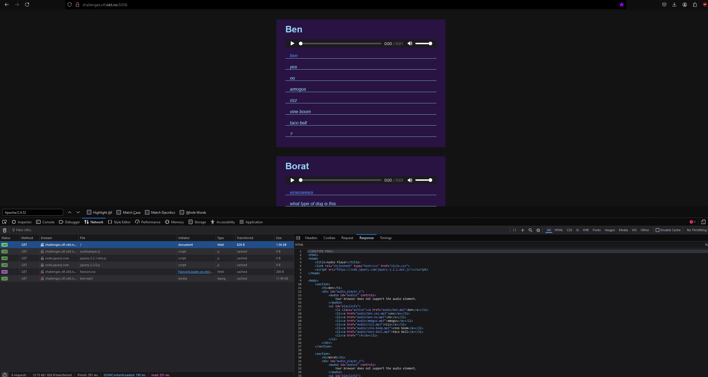
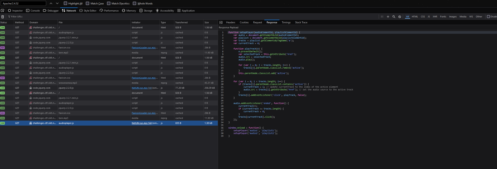
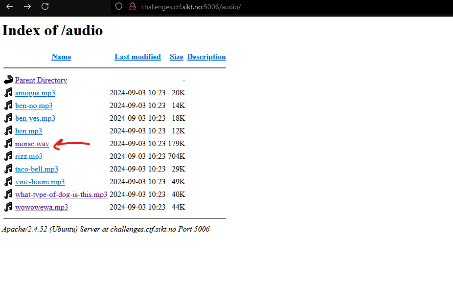
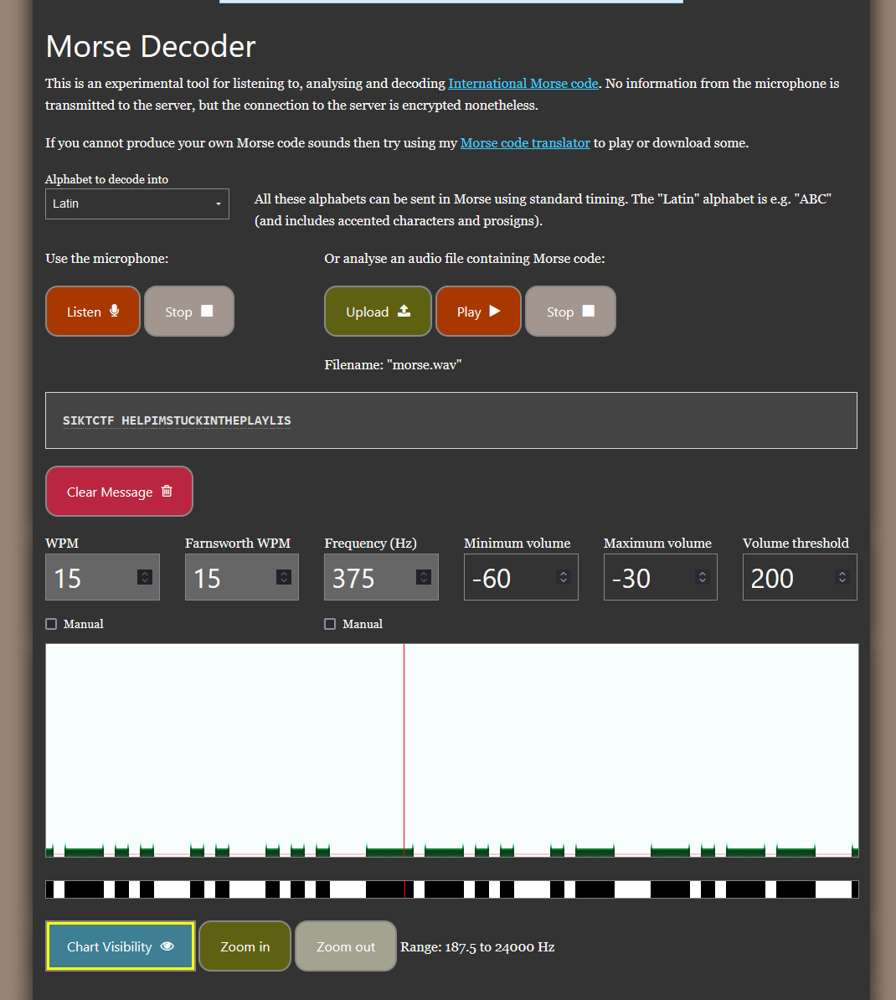

Challenge description:
```
My little brother made a new audio database and player site. Hope its secure...
http://challenges.ctf.sikt.no:5006/
```

Visiting the site we see a audio player that plays some funny sound clips:
<video controls src="20241010-2134-31.7069581.mp4" title="Website functionality"></video>


Looking through the network requests in devtools we see the HTML and some javascript that makes up the site:




It seems that all refs to the audio-clips returned in the request point to /audio/filename.


I attempt to visit http://challenges.ctf.sikt.no:5006/audio/ and find a .wav file which was not refrenced in the HTML.



Downloading and playing this reveals a morse code.

I uploaded the file to a online morse code decoder and got the flag.


It did not get the last "T" of playlist, so i appended it.

Flag:
```
SIKTCTF{HELPIMSTUCKINTHEPLAYLIST}
``` 
