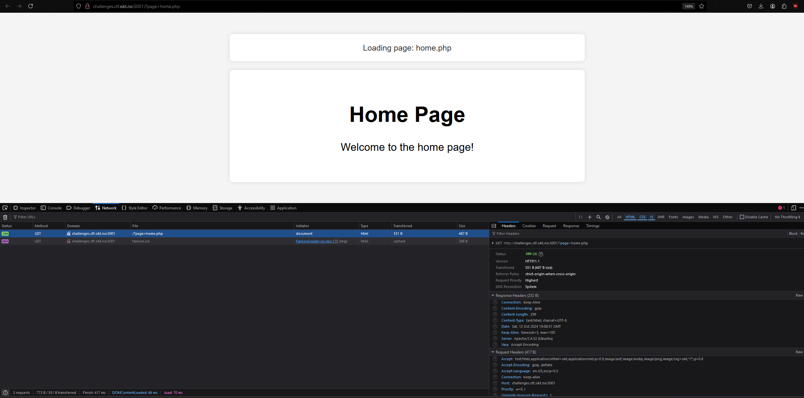
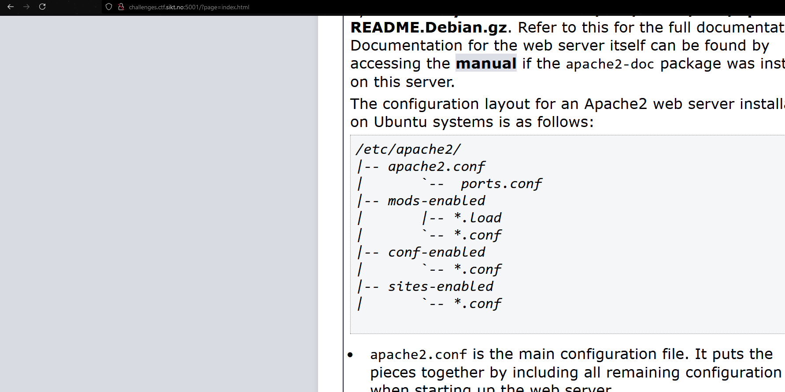
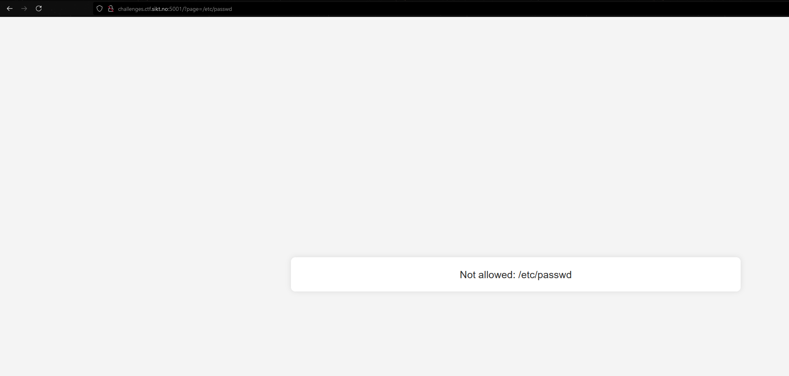
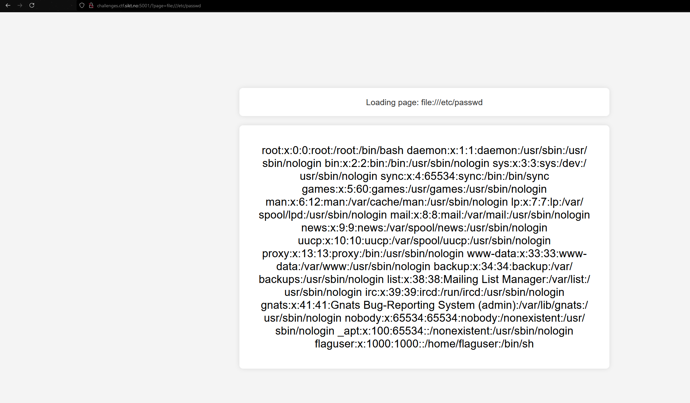
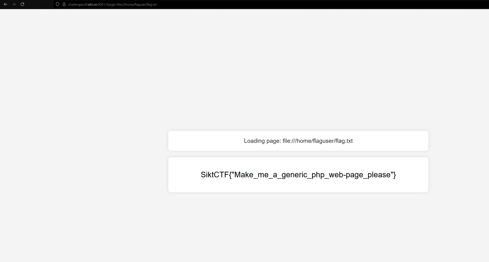

<h2>Challenge description:</h2>

```
find flag, it lies somewhere on the server.
http://challenges.ctf.sikt.no:5001/?page=home.php 
```

<h2>Solve:</h2>

Looking at the webpage it seems there is some logic that loads files with the "page=" query.

We can confirm this by changing out the provided query from ?page=home.php to ?page=index.html:
 

I wanted to see if i could get /etc/passwd file printed, but it all paths starting with "/" are blocked in some path filter:


After some googeling i found some PHP [wrappers](https://www.php.net/manual/en/wrappers.php).

The [file](https://www.php.net/manual/en/wrappers.file.php) wrapper appeared most applicable for me so i tested it with /etc/passwd:


In the passwd file we see a user called flaguser. I attempted to look for some command history, but i could not find any history files in the home folder. I also looked for other common files, but i could not get a hit. 
This was a good source for common linux files: [doomfist.gitbooks.io](https://d00mfist.gitbooks.io/ctf/content/local_file_inclusion.html)

In despair i tried tried /home//flaguser/flag.txt and actually got the flag 🤣:

<h2>Flag:</h2>


```
SiktCTF{"Make_me_a_generic_php_web-page_please"}
```