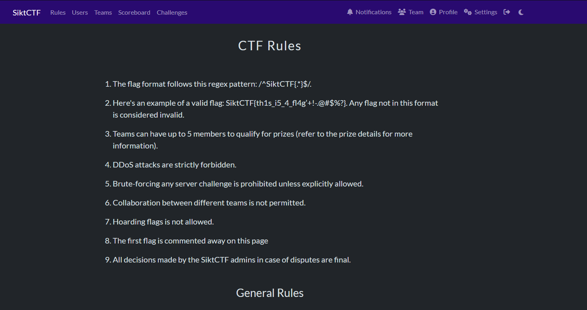
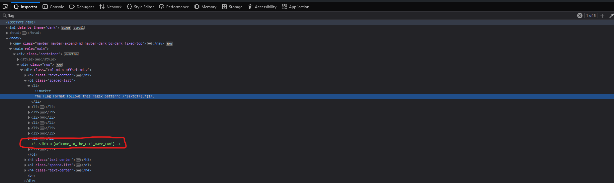

I spent way to long looking at the rules in Discord.
Turns out i misunderstood. I was supposed to read the rules on the website.

There it is mentioned that "The first flag is commented away on this page"




Looking in devtools we can search for "flag". There we find the comment.



Flag:
```
SiktCTF{Welcome_To_The_CTF!_Have_Fun!} 
```