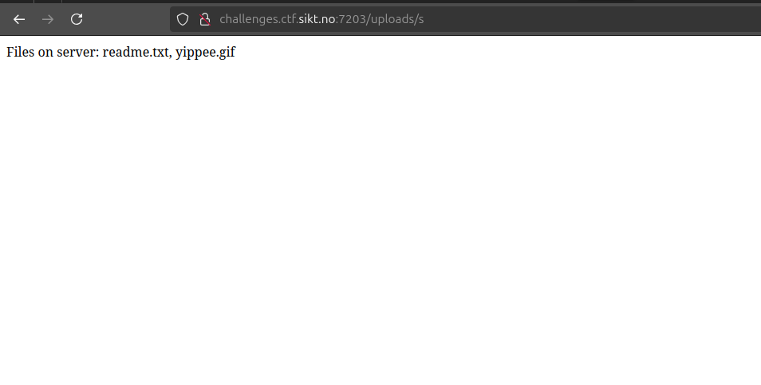
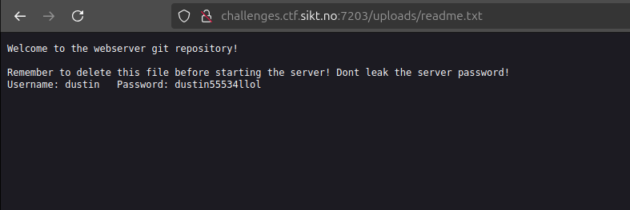
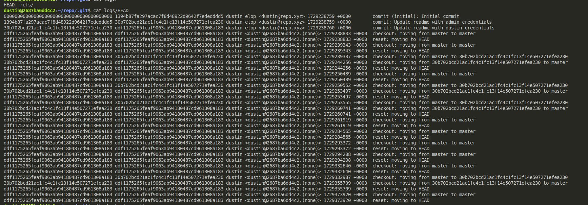

<h2>Challenge description:</h2>

```
Pwn the server to get the flag, the server-ports hide between 7000 and 8000
challenges.ctf.sikt.no 

```

<h2>Solve:</h2>
I started with a NMAP and found two services. One for SSH and one for HTTP:

```
vscode ➜ /workspaces/SiktCTF-2024/pwn/pwnbox (main) $ nmap -p 7000-8000  challenges.ctf.sikt.no 
Starting Nmap 7.80 ( https://nmap.org ) at 2024-10-19 21:50 UTC
Nmap scan report for challenges.ctf.sikt.no (13.48.166.53)
Host is up (0.026s latency).
rDNS record for 13.48.166.53: ec2-13-48-166-53.eu-north-1.compute.amazonaws.com
Not shown: 999 closed ports
PORT     STATE SERVICE
7203/tcp open  unknown
7204/tcp open  unknown


Starting Nmap 7.80 ( https://nmap.org ) at 2024-10-19 21:50 UTC
Nmap scan report for challenges.ctf.sikt.no (13.48.166.53)
Host is up (0.024s latency).
rDNS record for 13.48.166.53: ec2-13-48-166-53.eu-north-1.compute.amazonaws.com

PORT     STATE SERVICE VERSION
7203/tcp open  unknown
1 service unrecognized despite returning data. If you know the service/version, please submit the following fingerprint at https://nmap.org/cgi-bin/submit.cgi?new-service :
SF-Port7203-TCP:V=7.80%I=7%D=10/19%Time=671429C0%P=x86_64-pc-linux-gnu%r(G
SF:etRequest,481,"HTTP/1\.1\x20200\x20OK\r\nServer:\x20Werkzeug/3\.0\.4\x2
SF:0Python/3\.12\.3\r\nDate:\x20Sat,\x2019\x20Oct\x202024\x2021:50:56\x20G


Starting Nmap 7.80 ( https://nmap.org ) at 2024-10-19 21:52 UTC
Nmap scan report for challenges.ctf.sikt.no (13.48.166.53)
Host is up (0.024s latency).
rDNS record for 13.48.166.53: ec2-13-48-166-53.eu-north-1.compute.amazonaws.com

PORT     STATE SERVICE VERSION
7204/tcp open  ssh     OpenSSH 9.6p1 Ubuntu 3ubuntu13.5 (Ubuntu Linux; protocol 2.0)
Service Info: OS: Linux; CPE: cpe:/o:linux:linux_kernel

Service detection performed. Please report any incorrect results at https://nmap.org/submit/ .
Nmap done: 1 IP address (1 host up) scanned in 0.40 seconds

```

I start by checking out the website. Here you can upload a file and find it under /uploads/*filename*.

I tried to refrence a file that did not exist, and got all possible files in response:


Checking out readme.txt we get some credentials for a user.



I try these on the ssh port and get a session:
```
dustin@2687ba6dd4c2:~$ ls -al
total 56
drwxr-x--- 1 dustin dustin 4096 Oct 19 16:46 .
drwxr-xr-x 1 root   root   4096 Oct 18 08:05 ..
-rw------- 1 dustin dustin 5960 Oct 19 16:47 .bash_history
-rw-r--r-- 1 dustin dustin  220 Mar 31  2024 .bash_logout
-rw-r--r-- 1 dustin dustin 3892 Oct 18 08:06 .bashrc
drwx------ 2 dustin dustin 4096 Oct 18 08:07 .cache
-rw-r--r-- 1 root   root      0 Oct 18 08:05 .hushlogin
-rw------- 1 dustin dustin   20 Oct 19 16:46 .lesshst
-rw-r--r-- 1 dustin dustin  807 Mar 31  2024 .profile
drwx------ 2 dustin dustin 4096 Oct 19 10:18 .ssh
drwxr-xr-x 1 dustin dustin 4096 Oct 19 16:35 repo
```

I look for something in repo, but i only see the same file as the one on the website.
I go digging in the .git folder and look for some commits:



Here we see a commit called "commit: Update readme with admin credentials"

Lets check it out.
```
dustin@2687ba6dd4c2:~/repo$ git checkout  30b702bcd21ac1fc4c1fc13f14e507271efea230

dustin@2687ba6dd4c2:~/repo$ ls
readme.txt

dustin@2687ba6dd4c2:~/repo$ cat readme.txt 
Welcome to the repository!
Remember to delete this file before starting the server! Dont leak the server password!
Username: admin\tPassword: admin1992¤21#!PEccD11Erheh

```

Lets log in with the admin user:

```
(.venv) vscode ➜ /workspaces/SiktCTF-2024/pwn/pwnbox (main) $ ssh admin@challenges.ctf.sikt.no -p 7204
admin@challenges.ctf.sikt.no's password: 
admin@2687ba6dd4c2:~$ 
admin@2687ba6dd4c2:~$ 
admin@2687ba6dd4c2:~$ 
admin@2687ba6dd4c2:~$ ls
flag.txt
admin@2687ba6dd4c2:~$ cat flag.txt 
SiktCTF{Do_You_Know_How_To_Pwn?}
```

lets go

<h2>Flag:</h2>

```
SiktCTF{Do_You_Know_How_To_Pwn?}
```
